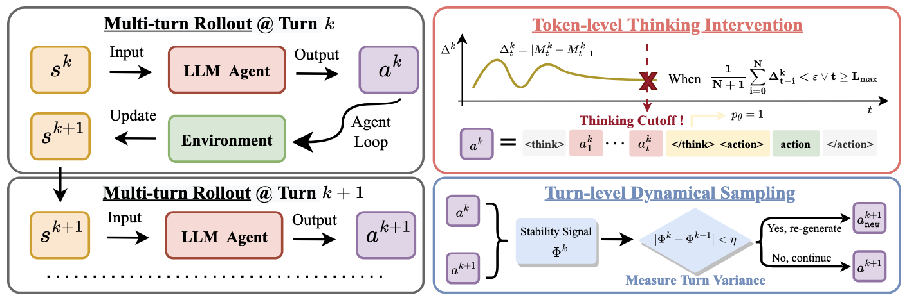

<div align="center">


  <div align="center">

  # <b>T<sup>2</sup>PO</b>: Uncertainty-Guided Exploration Control for Stable Multi-Turn Agentic RL

  </div>

  <div style="margin: 1.2em 0 0.7em 0;">
    <a href="https://github.com/WillDreamer/T2PO" align="center">
      
    </a>
    &nbsp;
    <a href="https://huggingface.co/collections/willhx/t2po">
      
    </a>
    &nbsp;
    <a href="https://arxiv.org/abs/24xx.xxxxx">
      
    </a>
    &nbsp;
    <a href="https://your-blog-post.com">
      
    </a>
  </div>
  
  <h3 align="center">
    
    <span style="font-size:1.3em;">&nbsp;|&nbsp;</span>
    
  </h3>
  
  <div align="center">

</div>


  
  
  <div align="center">
    <em>
      <span style="color:gray">Figure 1: Overview of the <b>T<sup>2</sup>PO</b> framework</span>
      &nbsp;｜&nbsp;
      <span style="color:crimson;"><b>ICML 2026 Spotlight</b></span>
    </em>
  </div>

</div>

---

**<span style="color:#fd4f57">Problem</span>:** Hesitation is defeat! Multi-turn RL for LLM agents is **powerful**, but critically limited by <span style="color:#0C8F8F; font-weight:bold;">poor exploration</span>.

**<span style="color:#116fb8">Key idea</span>:** Training fails mostly when agents repeat low-value actions or ignore task-level uncertainty.

**<span style="color:#3be5c3">Our method</span>:** **T<sup>2</sup>PO** directly controls exploration at both the token and turn level using uncertainty signals, greatly improving stability and sample efficiency.

---

## 🛠️ <span style="color:#116fb8;">T<sup>2</sup>PO Framework Design</span>

<table width="100%" style="max-width:720px; margin:18px auto; font-size:1.10rem; border-radius:10px; background:#fcfdfe;">
  <tr>
    <td>🔹 <b>Token-level:</b> <mark>T<sup>2</sup>PO</mark> tracks marginal uncertainty and triggers interventions when it dips below a threshold.</td>
  </tr>
  <tr>
    <td>🔸 <b>Turn-level:</b> <mark>T<sup>2</sup>PO</mark> resamples turns with negligible exploration progress, preventing wasted updates.</td>
  </tr>
  <tr>
    <td>📊 <b>Benchmarks:</b> Substantial gains on WebShop, ALFWorld, SearchQA and more—significantly better stability and learning efficiency.</td>
  </tr>
</table>

---

## 🔥 Key Features

- ✅ Support Training Multi-turn Embody Agents
- ✅ Support Training Multi-turn Search Agents
- ✅ Support Training Multi-turn Multi-modal Game Agents
- ✅ Support Training Multi-turn Web Agents
- ✅ Support Evaluating Commerical LLMs as Agents

---

## 💡 Getting Started

Our work is based on the following main dependencies:

```python
Python=3.11, VeRL=0.4.0, PyTorch=2.6.0, and vLLM=0.8.5
```

<details>
<summary>👉 <b>Click to expand installation guide</b> <em>(optional)</em></summary>

```bash
# (Optional) Install conda
bash set_conda.sh

# Install main dependencies
bash setup_env.sh

# Install extra requirements for specific tasks
conda activate verl
pip install -r requirements_xxx.txt
```
</details>

---

## 🚀 Existing Support

<details open>
<summary>🤖 <b>Embodied Agents</b></summary>

```bash
# 1. Build the environments
bash prepare_all_embody.sh

# 2. Run the demo code
conda activate agentrl_embody
bash examples/world_agent_trainer/train_xxx.sh
```
</details>

<details>
<summary>🛒 <b>Web Agents</b></summary>

```bash
# 1. Build the webshop environments
bash prepare_all_web.sh

# 2. Run the demo code
conda activate agentrl_web
bash examples/shop_agent_trainer/train_xxxx.sh
```
</details>

<details>
<summary>🕸️ <b>Search Agents</b></summary>

```bash
# 1. Build the RAG server environments
bash prepare_all_search.sh

# 2. Run the demo code
conda activate agentrl_search
bash examples/search_agent_trainer/train_xxx.sh
```
</details>

<details>
<summary>🎮 <b>Multi-modal Game Agents</b></summary>

```bash
# 1. Install the requirements
bash prepare_all_game.sh

# 2. Run the demo code
bash examples/game_agent_trainer/train_xxx.sh
```
</details>

---

## 🌊 Easy Extension

✨ <b>Extensible by Design:</b><br>
<ul>
  <li>All task recipes live in <code>recipe</code>. Wrap the VERL worker to plug in your own method. <a href="docs/extension.md">[usage]</a></li>
  <li>Add new environments under <code>agent_system</code>.</li>
  <li>Extra dependencies go into <code>requirements_xxx.txt</code>.</li>
  <li>Third-party tools? Place them in <code>AgentRL/sandbox</code>.</li>
</ul>

---

## 📊 Further Analysis

<details>
<summary>📈 <b>Expand for MLFlow analysis setup</b></summary>

```bash
# Install requirements
pip install mlflow

# Start server
mlflow server \
  --host 0.0.0.0 --port 5000 \
  --backend-store-uri sqlite:////tmp/mlruns.db \
  --default-artifact-root /tmp/mlruns

export MLFLOW_TRACKING_URI=http://127.0.0.1:5000

# Trainer config
actor_rollout_ref.rollout.trace.backend: mlflow  # or weave
actor_rollout_ref.rollout.trace.token2text: True
trainer.logger: ['console', 'mlflow']
```
</details>

---

## 🎆 Awesome Work for Reference

<details open>
<summary>🌟 <b>Show More (github & paper & hf & post)</b></summary>

<table width="100%" style="max-width: 950px; margin: 0 auto; font-size: 0.98rem;">
  <tr>
    <th>Project</th>
    <th>Description / Paper</th>
    <th>GitHub</th>
    <th>HuggingFace</th>
    <th>Paper/Post</th>
  </tr>

  <tr>
    <td><b>TinyZero</b></td>
    <td>DeepSeek R1 Zero for reasoning tasks</td>
    <td align="center"><a href="https://github.com/Jiayi-Pan/TinyZero"></a></td>
    <td align="center"></td>
    <td align="center"></td>
  </tr>
  <!-- ... rest of awesome work remains unchanged ... -->
</table>
</details>
